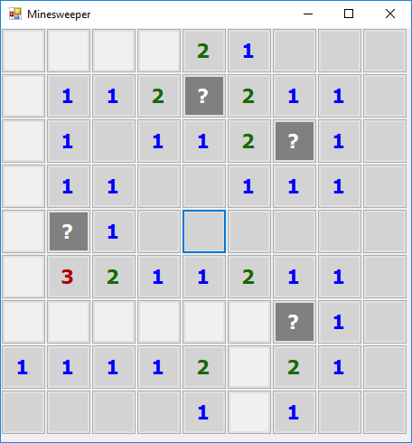

# Minesweeper

Made a mini project where base code was already given. 
<bold>What learned during this project</bold>
`Unit testing - i used XUnit`
`This was first project of Windows Forms for me`
`Little bit about Enums`

How to test it:  

My result:

Create a classic minesweeper game, you are given some starting point already.

## Requirements

You are presented with a board of squares. Some squares contain mines (bombs), others don't. If you click on a square containing a bomb, you lose. If you manage to click all the squares (without clicking on any bombs) you win.
Clicking a square which doesn't have a bomb reveals the number of neighbouring squares containing bombs. Use this information plus some guess work to avoid the bombs.
To open a square, point at the square and click on it. To mark a square you think is a bomb, point and right-click.

- A squares "neighbours" are the squares adjacent above, below, left, right, and all 4 diagonals. Squares on the sides of the board or in a corner have fewer neighbors. The board does not wrap around the edges.
- If you open a square with 0 neighboring bombs, all its neighbors will automatically open. This can cause a large area to automatically open.
To remove a bomb marker from a square, point at it and right-click again.
- The first square you open is never a bomb.
- If you mark a bomb incorrectly, you will have to correct the mistake before you can win. Incorrect bomb marking doesn't kill you, but it can lead to mistakes which do.
- You don't have to mark all the bombs to win; you just need to open all non-bomb squares.
